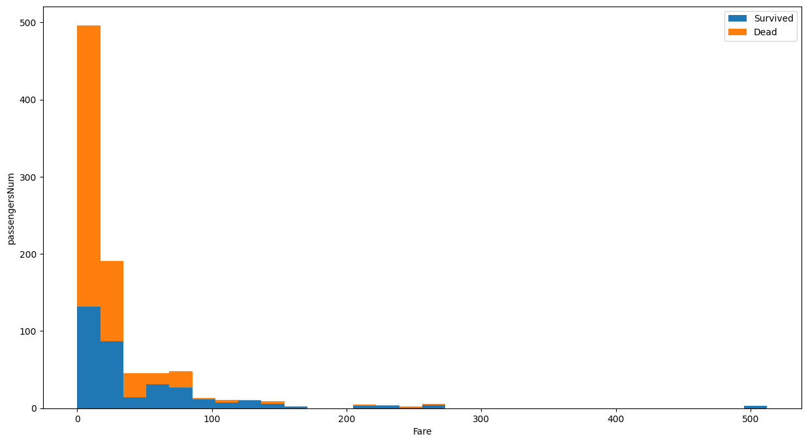

# Kaggle競賽：Titanic - Machine Learning from Disaster

## 原始碼
[原始碼檔案](Titanic - Machine Learning from Disaster.ipynb)

## 成員

## 成績

## 摘要
本組選擇鐵達尼號生存預測為對這件事故有初略的了解，且是歷史上重要的事件之一。因此想透過乘客資訊像是性別、年齡…等去預估乘客是否會在鐵達尼號沉沒意外中生存下來。

## 介紹（研究背景及研究目的）
鐵達尼號沉沒事故是當時北大西洋發生的最大著名船難，當時與冰山擦撞前，已收到6次海冰警告，船行駛的速度快速，看到冰山已經為時已晚，無法及時轉向，16個水密隔艙中的5個進水，而鐵達尼號的設計只能承受4個水密隔艙進水因此沉沒，此次災難造成1514人死亡。因此我們想藉由此事件，透過訓練數據分析生還人數，且能預防未來相似的事件發生。

## 資料集介紹(含資料特徵)及資料集來源
此競賽共有2份資料集，分別為train(用來訓練模型)及test(要求預測結果)，還有一份data(合併train與test的資料)，以利接下來的處理。

| 特徵名稱 | 特徵定義 | Key |
|:-------- | -------- | -------- |
| PassengerId     | 乘客編號     |      |
| Survived     | 是否倖存     | 1:是 / 0:否     |
| Pclass     | 船票等級     | 1:最高 / 2:中等 / 3:最低     |
| Name     | 姓名     |      |
| Sex     | 性別     |      |
| Age     | 年齡     |      |
| SibSp     | 同為兄弟姐妹或配偶的數目     |      |
| Parch     | 同為家族父母及小孩的數目     |      |
| Ticket     | 船票編號     |      |
| Fare     | 船票價格     |      |
| Cabin     | 船艙號碼     |      |
| Embarked     | 登船點     | C=Cherbourg、Q=Queenstown、S=Southampton|

## 資料預處理

由以上合併資料結果來看，得知：
* Age 缺1309 - 1046 = 263筆資料
* Fare 缺1309 - 1308 = 1筆資料
* Cabin 缺1309 - 295 = 1014筆資料
* Embarked 缺1309 - 1307 = 2筆資料

因此先**填補缺漏值**：
* Age：我們以乘客稱呼(Miss.、Ms.等…)來區分，並分別填上平均年齡。
* Fare：因只有缺1筆資料，所以直接用平均值填入。
* Cabin：因缺值太多，目前選擇先不作為特徵使用。
* Embarked：從分析上，發現C港口的乘客大多是P1等級的票，因此選擇填入C值。

**檢視非數值欄位**：

Name欄有2筆是重複的，而Sex欄只有Male/Female這2種值，其中以Male最多，有843位。

### 船上的乘客各年齡層的男女比例：
由下圖可得知小於20歲的男女人數比例接近，但若超過20歲(含20)的乘客，則男性比例則比女性多。

從下圖可得知，以人數來看不同性別的存活率，發現男性的存活率只有19%，而女性則高達74%。

### 船票等級與存活的關係：
從人數來看不同船票等級的存活率：可以看出等級3的乘客最多，死亡者也大多為等級3的乘客。

### 不同年齡層與倖存的關係：
從下圖可看出不同年齡層與倖存的關係，其中年齡越小存活率越高。

### 不同票價與存活的關係：
由下方結果可發現，票價愈高存活率愈大。

### 上岸港口與船票等級的關係：
從以下統計結果可看出不同港口的乘客有不同的經濟狀況，C港口的乘客大多購買等級最高的票，Q港口的乘客則是購買最低等級的票。

## 機器學習或深度學習方式（使用何種方式）
填補完缺漏值，確認資料無缺漏後，使用多種演算法來測試模型，並測試使用自己增加的Feature與使用原始Feature兩者的差異。最後根據測試結果，我們評估後決定使用隨機森林來訓練模型。

### 使用隨機森林來訓練模型：

### 將結果輸出至gender_submission.csv檔：

## 研究結果及討論（含模型評估與改善）

根據以上測試結果，發現XGB、GBDT、LGBM、邏輯斯回歸、隨機森林等都有蠻高的分數，因此我們分別將分數超過0.85的演算法上傳至Kaggle評分，得出以下分數：

### 結論：
一開始在測試階段時，我們有嘗試自己額外添加Feature，但實際上傳評分時效果並不佳，後來使用原始Feature與測試多個演算法過程中，我們得出LightGBM是最好的，但上傳至Kaggle卻是RandomForest最好，我們目前推測可能是因為資料的過度擬和才會造成此問題，必須再對資料進行更好的處理，從而來解決問題並獲得更好的分數。

## 參考文獻
1. [Kaggle - Learn](https://www.kaggle.com/learn)
2. [輕量化的梯度提升機](https://ithelp.ithome.com.tw/m/articles/10274577)
3. [機器學習中的參數調整](https://zhuanlan.zhihu.com/p/37310443)
4. [Python 資料視覺化筆記](https://yanwei-liu.medium.com/python-%E8%B3%87%E6%96%99%E8%A6%96%E8%A6%BA%E5%8C%96%E7%AD%86%E8%A8%98-%E4%B8%89-%E4%BD%BF%E7%94%A8matplotlib%E7%B9%AA%E5%9C%96-d545d187f77f)
5. [隨機森林 (Random forest)](https://ithelp.ithome.com.tw/articles/10272586)

